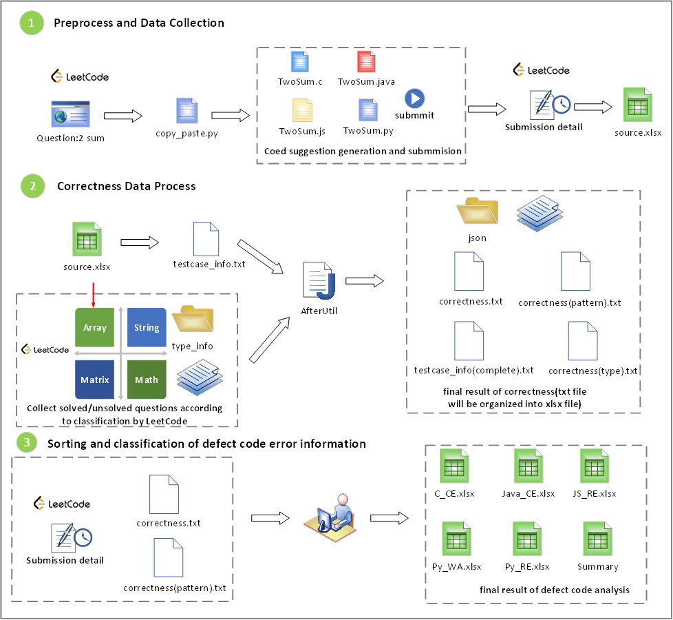
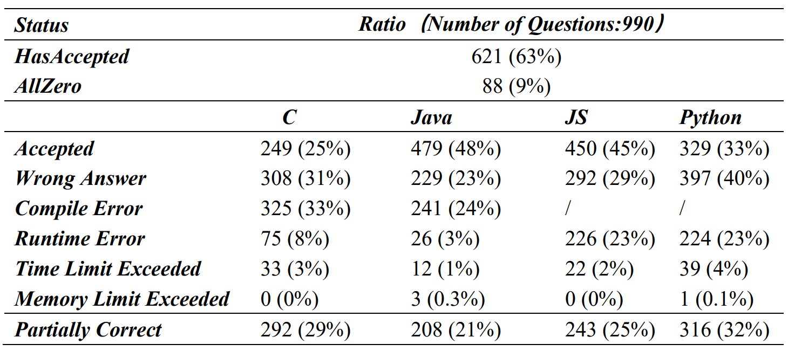
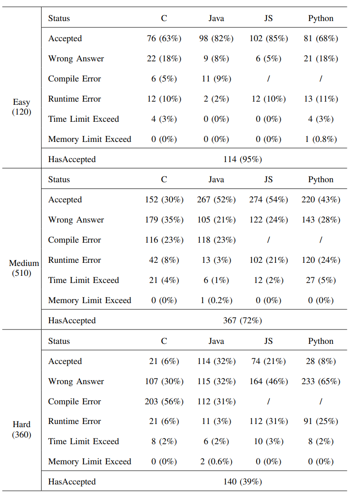
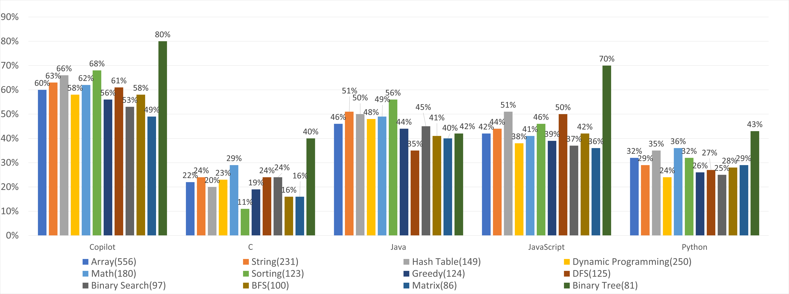
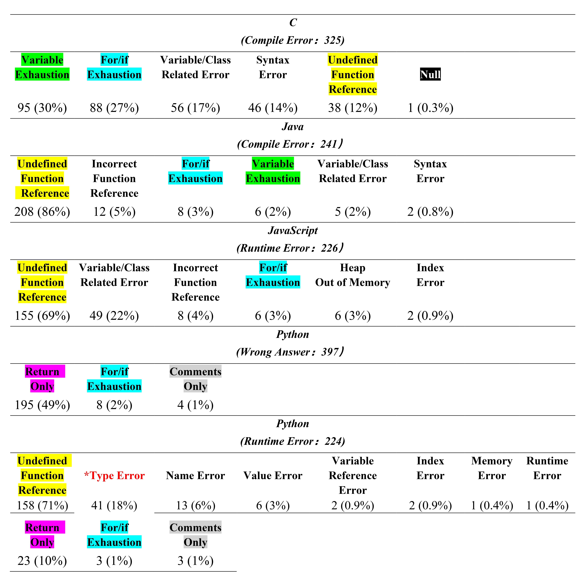

# Github Copilot Code Suggestion Correctness Evaluation and Error Types Summary

- [Introduction](#1.Introduction ) 
- [Evaluation Result](#2.Evaluation-Result)
- [Structure of the project](#3.Structure-of-the-Project)
- [How to Reproduce](#4.How-to-Reproduce)




## 1.Introduction

  Our study experiment use LeetCode question pool which provides complete question description and corresponding function template including function name, return type, variables and variables’ types as input of Copilot. To evaluate the correctness, we choose 990 LeetCode questions, covering 3 difficulties and 12 problem types, and generate 3960 code suggestion files in 4 languages(C, Java, JavaScript, Python). We manually collect code’s execution status by running code suggestion on LeetCode’s online coding environment and write them on a table as input of our Java program tool to generate correctness file(overall, difficulty, problem types). As for the error types, based on our tables and submission detail provided by LeetCode, we select 5 defect statuses in 4 languages as the scope of error classification and manually summarize 17 error types as well as raise the concept of *Abnormal Code Suggestion*. Our study focuses on the following four research questions: 

***RQ*1**:  How correct are Copilot code suggestions? 

***RQ*2**:  How correct are Copilot under different difficulty context? 

***RQ*3**:  What is the correctness performance of Copilot on 12 different problem types?

***RQ*4**:  What error types of defects code suggestions does Copilot have?


## 2.Evaluation Result

### 2.1 ***RQ*1**:  How correct are Copilot code suggestions? 



### 2.2 ***RQ*2**:  How correct are Copilot under different difficulty context?



### 2.3 ***RQ*3**:  What is the correctness performance of Copilot on 12 different problem types?




### 2.4 ***RQ*4**:  What error types of defects code suggestions does Copilot have?




## 3.Structure of the Project

```powershell
├── AfterUtil         :util that processes collected data in step 2 
├── IMG               :image
├── Output            :code suggestion files generated by PreUtil
├── PreUtil           :util that processes problem description and function templates
├── RQ1_TO_RQ3        :correctness-related files and corresponding json files
├── RQ4               :records of error types and problem links in 5 defect statuses.
├── Table             :tables answering RQ1-RQ4
├──README.md          :user guidance
└──source.xlsx        :total record of problem links and its corresponding submitted status in 4 languages
```


## 4.How to Reproduce

### 4.1 Correctness Evaluation Reproduce

   If you choose our problem sample, you can download our experimental file *output* to get all code suggestion files, deploy it in an editor that supports Copilot (such as VSCode), delete the original content in the function body and generate suggestions again . submit the generated code by Copilot to its LeetCode website, and recorded the submitted status according to the format of *source.xlsx*.

   if you choose new problems,  you might follow the steps illustrated in the figure of our experimental process:

1. find *copy_paste.py*  in *PreUtil*, it is a python script created by [Nhan](https://github.com/nhtnhan/MSR2022_Copilot) and we made some improvements. you copy and paste LeetCode question's description and function templates in 4 languages and run this script to get code suggestion files.
2. in code suggestion file, use Copilot to generate suggested code and copy it to LeetCode to execute. 
3. write the submitted status and test cases information in  *source.xlsx* (confirm correct format). After recording all your problems situations, copy 
4. After you submit all your problem's code suggestions, you can check solution situation of one specified problem type through LeetCode's type classification API. write these problems information in text files of  *type_info*.(confirm the format)
5. Run AfterUtil and you can get all correctness-related files.


### 4.2 Error types Summary

  we picked up 5 defect statuses(explain in paper): Compile Error of C, Compile Error of Java, Runtime Error of JavaScript, Wrong Answer of Python and Runtime Error of Python to check the error logs of submission detail and manually observe the characteristic of code to summarize error types.

  If your reproduction has something new and different, we welcome your sharing.

