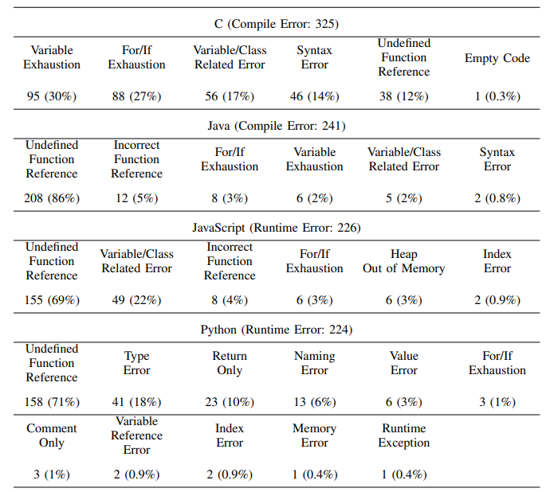

# Correctness of GitHub Copilot’s Code Suggestions Analysis

- [Introduction](#1.Introduction ) 
- [Evaluation Result](#2.Evaluation-Result)
- [Structure of the project](#3.Structure-of-the-Project)


## 1.Introduction

  For each problem, we use Copilot to generate code suggestions in four popular programming languages, including C, Java, JavaScript, and Python. Then we run the code suggestions one by one on LeetCode’s online coding environment. By collecting and analyzing their execution status and details, we conduct an empirical study on evaluating the correctness of Copilot, use a dataset with 990 coding problems and extensively answer the following research questions:

***RQ*1**:  To what extent can the Copilot provide correct code suggestions?

***RQ*2**:  For the coding problems with different difficulties, what is the performance of Copilot?

***RQ*3**:   For the coding problems in different domains, What is the performance of Copilot?

***RQ*4**:  What are the reasons for the incorrectness of Copilot’s code suggestions?


## 2.Evaluation Result

### 2.1 ***RQ*1**:  To what extent can the Copilot provide correct code suggestions?


### 2.2 ***RQ*2**:  For the coding problems with different difficulties, what is the performance of Copilot?


### 2.3 ***RQ*3**: For the coding problems in different domains, What is the performance of Copilot?


### 2.4 ***RQ*4**:  What are the reasons for the incorrectness of Copilot’s code suggestions?





## 3.Structure of the Project

```powershell
├── Tool                  :util that generate code files and analysis submission result
├── IMG                   :image
├── Output                :code suggestion files                
├── RQ1_TO_RQ3            :result of RQ1~RQ3
├── RQ4                   :result of RQ4
├──README.md              :guidance of our experiment
└──SubmissionResult.xlsx  :result of our experiment
```


