# Correctness of GitHub Copilot’s Code Suggestions Analysis

- [Introduction](#1.Introduction ) 
- [Evaluation Result](#2.Evaluation-Result)
- [Structure of the project](#3.Structure-of-the-Project)

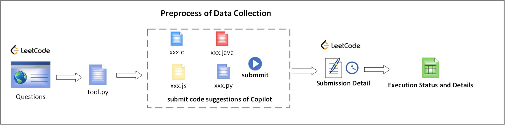


## 1.Introduction

  For each problem, we use Copilot to generate code suggestions in four popular programming languages, including C, Java, JavaScript, and Python. Then we run the code suggestions one by one on LeetCode’s online coding environment. By collecting and analyzing their execution status and details, we conduct an empirical study on evaluating the correctness of Copilot, use a dataset with 990 coding problems and extensively answer the following research questions:

***RQ*1**:  To what extent can the Copilot provide correct code suggestions?

***RQ*2**:  For the coding problems with different difficulties, what is the performance of Copilot?

***RQ*3**:   For the coding problems in different domains, What is the performance of Copilot?

***RQ*4**:  What are the reasons for the incorrectness of Copilot’s code suggestions?


## 2.Evaluation Result

### 2.1 ***RQ*1**:  To what extent can the Copilot provide correct code suggestions?

<figure>
    
    <figcaption align="center"><b>Table 1. Performance of Copilot</b></figcaption>
</figure>


<center>Table1</center>

<center>Performance of Copilot</center>


### 2.2 ***RQ*2**:  For the coding problems with different difficulties, what is the performance of Copilot?

<center>Table2</center>

<center>Performance of Copilot in Easy, Medium, Hard problems</center>


### 2.3 ***RQ*3**: For the coding problems in different domains, What is the performance of Copilot?

<center>Copilot's Performance on the Code Problems in Different Types</center>

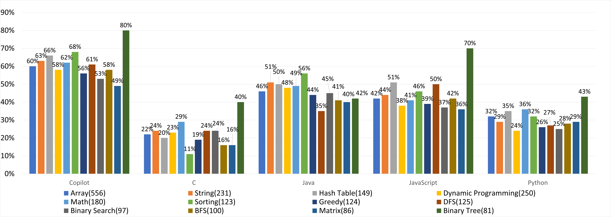


### 2.4 ***RQ*4**:  What are the reasons for the incorrectness of Copilot’s code suggestions?

#### 2.4.1 Code Abnormalities Definitions

For code suggestions not in *Accepted* status, we dig into the following reasons why they couldn't get accepted. We inspected coed suggestions in Wrong Answer, Compile Error and Runtime Error that mainly leading to incorrect code according to Table 1.

***Code Abnormalities***. A large number of code suggestions exhibit "abnormal" implementations. We define these code abnormalities into the following types.

- *Undefined Function Reference*: the suggested code fails due to referring to an undefined function that hasn't been implemented. Figure 1  shows an example of this type, from which we can see that function *isSimilar()* is not implemented in the suggested code fragments.

  

  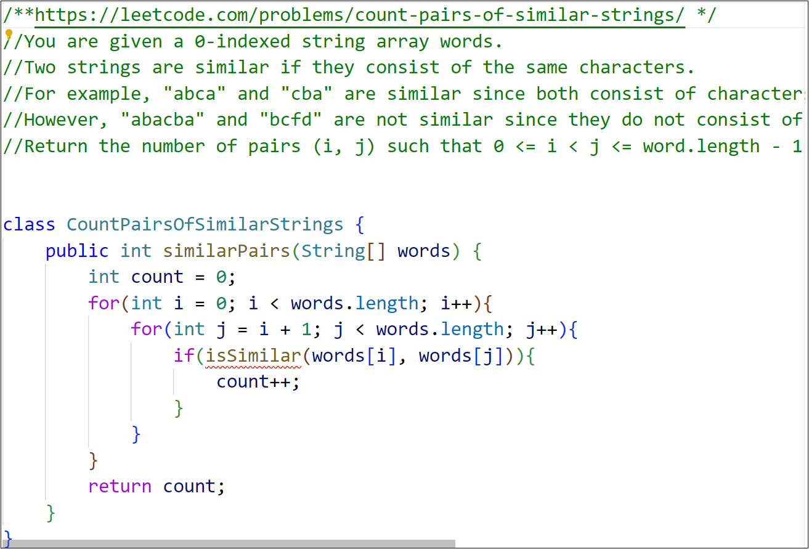

  <center>Fig. 1. Example of Undefined Function Reference, Problems: Count Pairs of Similar Strings</center>

- *Variable Exhaustion*: the suggested code contains a huge number of variable definitions. Figure 2 shows an example of this type.

  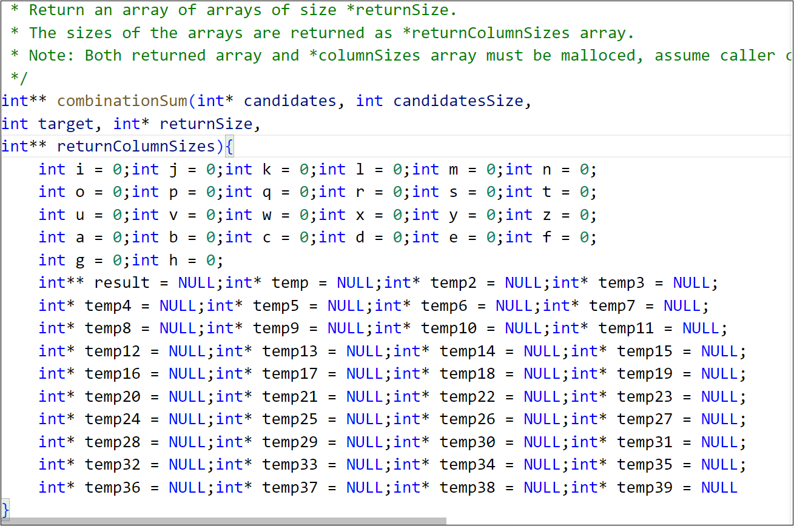

  <center>Fig. 2. Example of Variable Exhaustion, Problem: Combination Sum</center>

- *For/if Exhaustion*: the suggested code contains a large number of repeated *for* or *if* statements. Figure 3 and Figure 4 show examples of this type in a nested or sequential form, respectively. We find this type often leads to unclosed statement blocks because of the extensive *if* or *for* statements.

  

  <center>Fig. 3. Example of For/if Exhaustion in nested form, Problem: Word Search</center>

  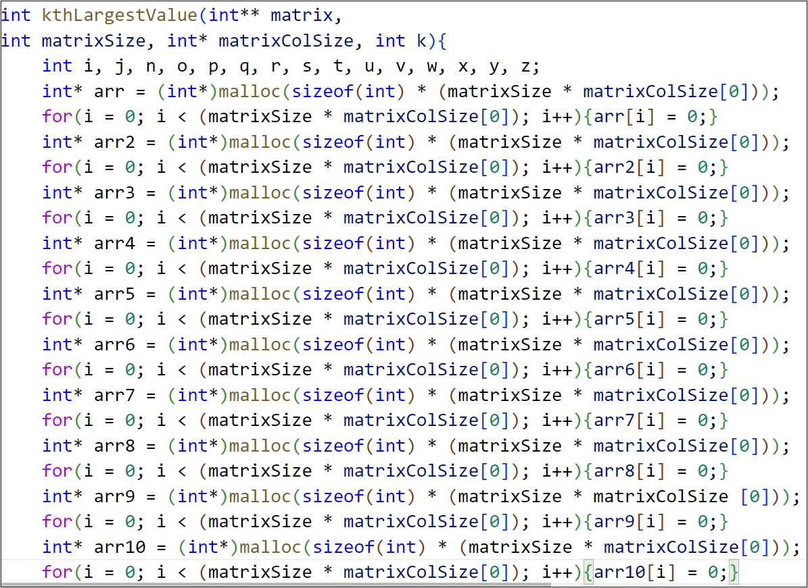

  <center>Fig. 4. Example of For/if Exhaustion in sequential form, Problem: Find Kth Largest XOR Coordinate Value</center>

- *Return Only*: the suggested code only contains the return statement or returns an assigned variable. Figure 5 shows an example. We have found that this type of abnormality only occurs in Python.

  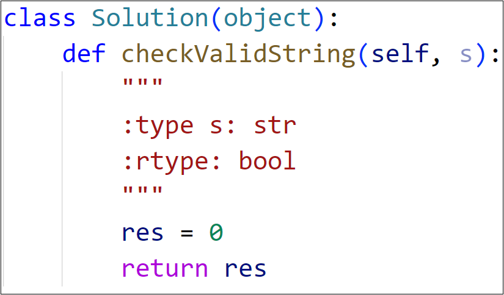

  <center>Fig. 5. Example of Return Only, Problem: Valid Parenthesis String</center>

- *Comments Only*: the suggested code only contains comments. Figure 6 shows an example. We find this kind of abnormality only happens in Python as well.

  

  <center>Fig. 6. Example of Comments Only, Problem: Permutation Sequence</center>

- *Empty Code*: there is no code suggestion generated by Copilot. Only one coding problem encounters this(Problem: *Basic Calculator IV*).
- *Variable/Class Related Error*:  the suggested code fails due to referring to undefined or uninitialized variables or classes. Figure 7 shows an example that  *count* is an undeclared variable leading to compile error.

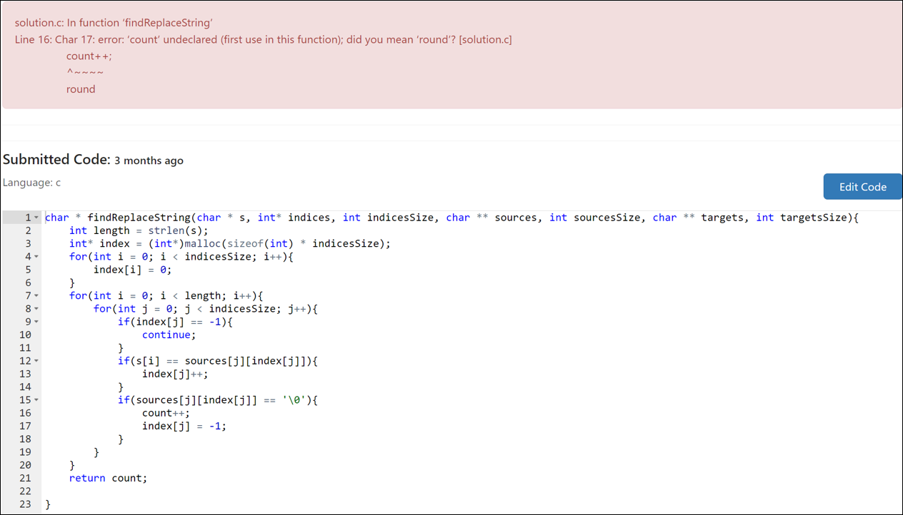

<center>Fig. 7. Example of Variable/Class Related Error, Problem: Find And Replace in String</center>

- *Syntax Error*: suggested code contains statements that disobey the syntax. Figure 8 shows an example that places a double value at the ends of *%*.

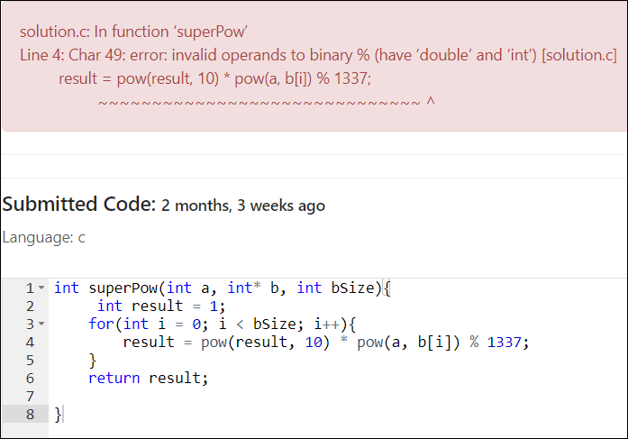

<center>Fig. 8. Example of Syntax Error, Problem: Super Pow</center>

- *Incorrect Function Reference*: the suggested code incorrectly references existing functions, which is usually caused by the conflicts of argument quantities or argument types. Figure 9 shows an example that the argument of the referenced function *rob()* should be an *int* array.

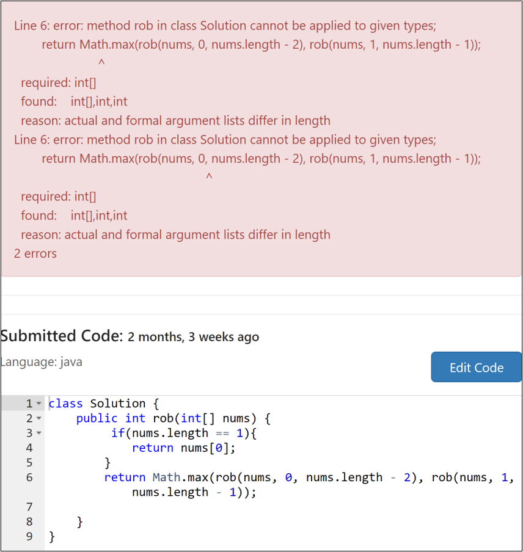

<center>Fig. 9. Example of Incorrect Function Reference, Problem: House Robber II</center>

- *Heap out of Memory*: the running of the suggested code in JavaScript exceeds the heap memory. Figure 10 shows an example.

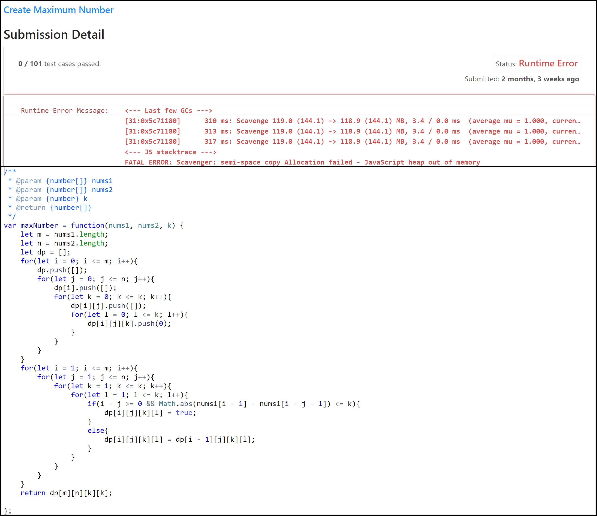

<center>Fig. 10. Example of Heap out of Memory, Problem: Create Maximum Number</center>

- *Index Error*: the index of a data Structure (*e.g Array, List, etc.*) in the suggested code exceeds its specified range. Figure 11 shows an example.

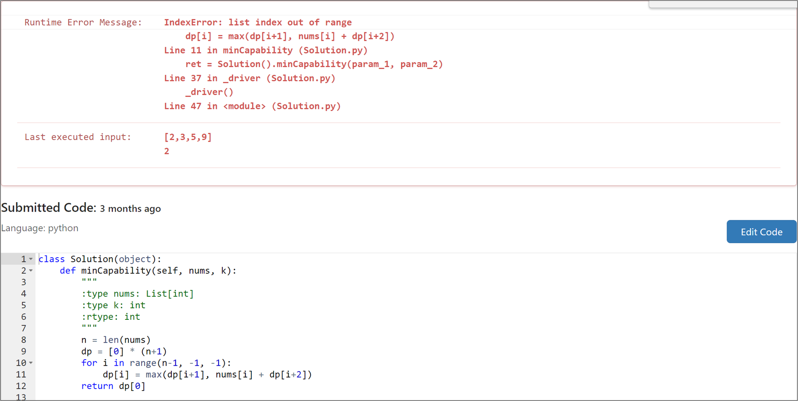

<center>Fig. 11. Example of Index Error, Problem: House Robber IV</center>

- *Type Error*: the suggested in Python returns the wrong type value or references wrong type variables. Figure 12 shows an example.

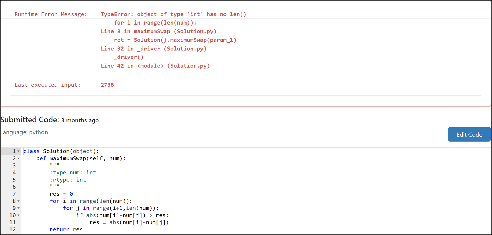

<center>Fig. 12. Example of Type Error, Problem: Maximum Swap</center>

- *Naming Error*: the suggested code in Python references undefined variables. Figure 13 shows an example.


<center>Fig. 13. Example of Naming Error, Problem: Largest Sum of Averages</center>

- *Value Error*: there is at least one empty-value argument in the functions of the suggested code. Figure 14 shows an example.

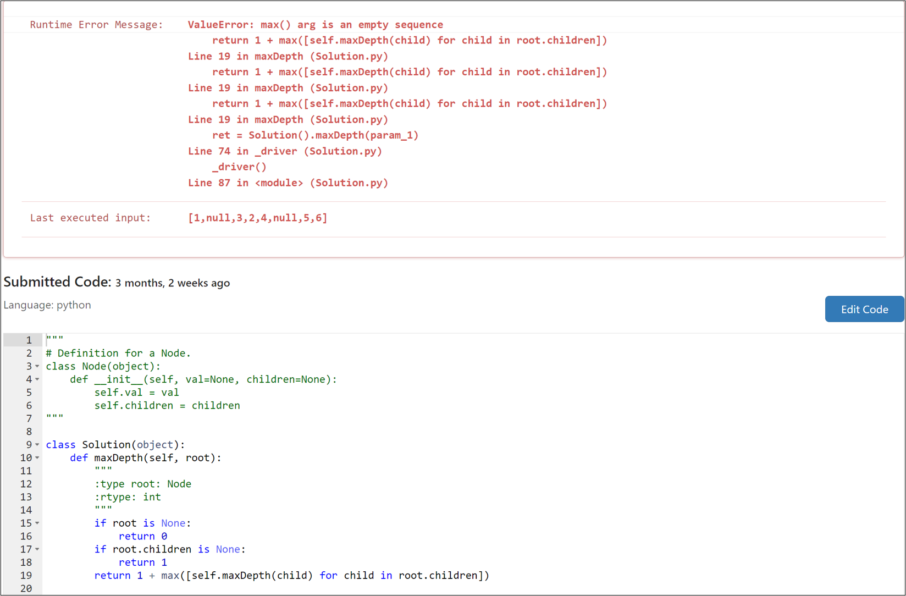

<center>Fig. 14. Example of Value Error, Problem: Maximum Depth of N-ary Tree</center>

- *Variable Reference Error*: the suggested code refers unassigned variable. Figure 15 shows an example.

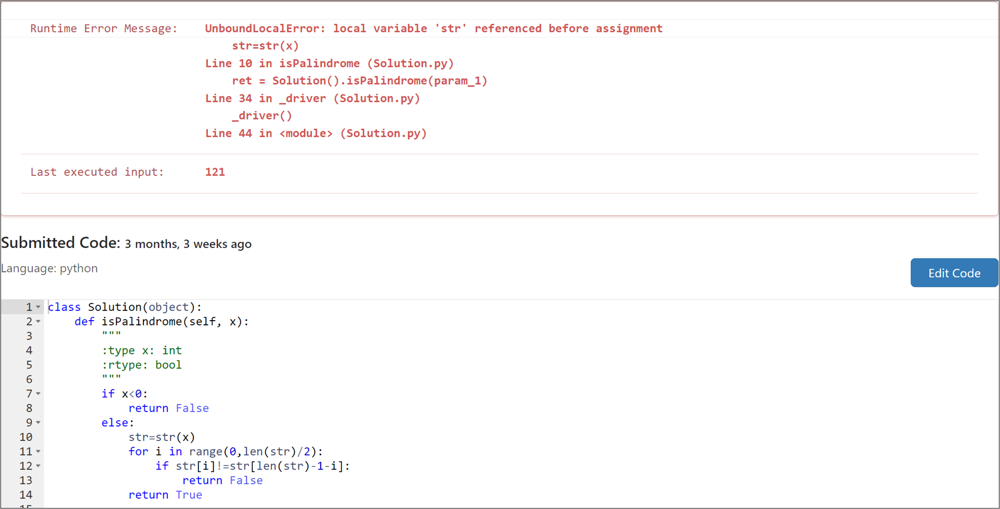

<center>Fig. 15. Example of Variable Reference Error, Problem: Palindrome Number</center>

- *Memory Error*: the suggested code gets the memory overflows. Figure 16 shows an example.

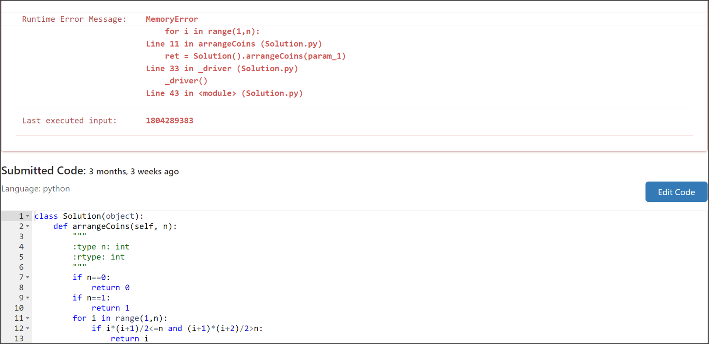

<center>Fig. 16. Example of Memory Error, Problem: Arranging Coins</center>

- *Runtime Exception*: the suggested code exceeds the maximum recursion depth during its execution. Figure 17 shows an example.

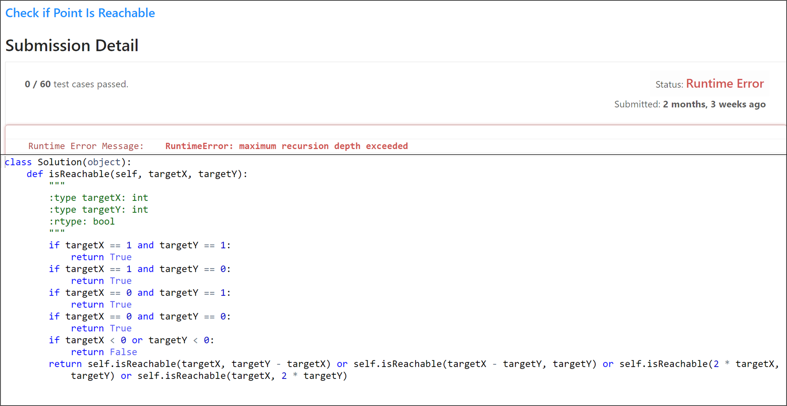

<center>Fig. 17. Example of Runtime Exception, Problem: Check If Point Is Reachable</center>

#### 2.4.2 Result

***Wrong Answer***. we first analyze the reasons why the code suggestions get the *Wrong Answer* status. From the experiment, we have found that most of these statuses are caused by wrong outputs. In this case, the suggested code can run normally without any errors, but it cannot pass some test cases due to its outputs cannot match the expected outputs. We denote such cases as *regular cases* in Table 3. However, according to our observation, some code suggestions exhibit *code abnormalities* that are defined above. So we summarize these types in Table 3.

<center>Table3</center>

<center>Statistics of Wrong Answer Status</center>


For the ***Compile Error*** (C and Java) and ***Runtime Error*** (JavaScript and Python), we also examine the code fragments and summarized the observations in Table 4:

<center>Table 4</center>

<center>The Reasons for Compile Error and Runtime Error</center>


## 3.Structure of the Project

```powershell
├── Tool                  :tools that generate code files and analysis submission result
├── IMG                   :image
├── Output                :code suggestion files                
├── RQ1_TO_RQ3            :result of RQ1~RQ3
├── RQ4                   :result of RQ4
├──README.md              :guidance of our experiment
└──SubmissionResult.xlsx  :result of our experiment
```


