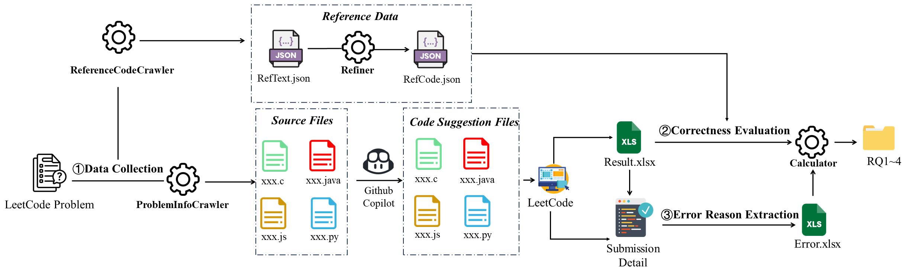
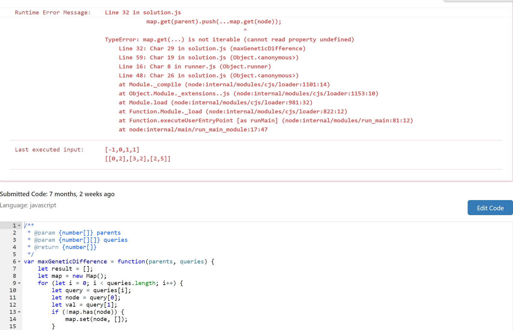

# Assessing and Analyzing the Correctness of Github Copilot's Code Suggestions

- [Introduction](#1.Introduction ) 
- [Project structure and explanation](#2.Project-Structure-and-explanation)
- [Evaluation Result](#3.Evaluation-Result)




## 1.Introduction

  This is a public database of code suggestions. We use all questions (2033 in total) in LeetCode supporting four languages as input and use Copilot to generate code suggestions. We recorded the execution results of these code suggestions and summarized the error causes of unsuccessful code suggestions. In addition, we also collected the top three most popular solutions in the comment area of each question as reference codes to compare the similarity between the two. Our research questions are as follows: 

***RQ*1**:  To what extent can Copilot provide the correct code suggestions, and how similar are the code suggestions to the reference code?

***RQ*2**:  For the coding problems with different difficulties, what is the performance of Copilot? 

***RQ*3**:   For the coding problems in different domains, what is the performance of Copilot?

***RQ*4**:  What are the reasons for the incorrectness of Copilot's code suggestions and why?

 The date of our experiments and the relevant versions of the tools are shown in Table 1


## 2.Project Structure and explanation

```powershell
├── Figure                     
├── output                             
├── results
   ├── RQ1_to_RQ3
   └── RQ4
├── ProblemInfoCrawler
├── ReferenceCodeCrawler
├── Refiner
├── Calculator
└── record.xlsx       
```

- ***Figure***  : Experimental result pictures and error cause code examples
- ***output*** : All code suggestion files, sorted by language and difficulty
- **results/RQ1_to_RQ3**:   Experimental results from RQ1 to RQ3
- **results/RQ4** :    Experimental results of RQ4
- **ProblemInfoCrawler**:   The scripts under this file is used to automatically collect LeetCode problem descriptions, function templates, and problem attribute information (difficulty, type, time)
- ***ReferenceCodeCrawler*** :   The scripts under this file is used to automatically collect reference codes for each problem solution
- ***Refiner*** :   The scripts under this file is used to refine the reference code and filter out irrelevant text
- ***Calculator:*** The script under this file is used to calculate the experimental results
- ***record.xlsx***: This file is a record of the experimental sample, including the link to the question, difficulty, execution status of the corresponding language code suggestion, question type, the time the question was posted
- ***README.md***:   User guidance

## 3.Evaluation Result

### 3.1 ***RQ*1**:  To what extent can the Copilot provide correct code suggestions?


### 3.2 ***RQ*2**:  For the coding problems with different difficulties, what is the performance of Copilot?


### 2.3 ***RQ*3**: For the coding problems in different domains, What is the performance of Copilot?


<center>Overall Performance of Copilot</center>


<center>Performance of C</center>


<center>Performance of Java</center>


<center>Performance of JavaScript</center>


<center>Performance of Python</center>

### 3.4 ***RQ*4**:  What are the reasons for the incorrectness of Copilot’s code suggestions and why?

#### 3.4.1 Wrong Answer Results


#### 3.4.2 Compile Error Results


#### 3.4.3 Runtime Error Results


#### 3.4.4 Error type explanation

***Wrong Answer:***

- *logic Error*:  there is nothing wrong with the code itself, but the logic suggested by the code does not allow it to pass all test cases.

- *Return Only*:  the code in this case only contains ***return*** statements. There are three forms of return statements: 1) Return function parameters directly; 2) Return constants; 3) Return function parameters after constant assignment.

  

- *Pass Only*:  this code case only appears in Python. the code suggestion does nothing by only giving  the pass statement.


***Compile Error:***

- *Undeclared Variable*: the code suggestion references an undeclared variable or undeclared member variable in a data structure.


- *Variable Redeclaration*: the code suggestion redeclares a variable name.


- *Undefined Class Reference*: the code suggestion references undefined class.


- *Variable Declaration Only*: the code suggestion generates only a series of variable declaration statements. And when we call Copilot at the end of the code, we still get a series of declaration statements.


- *Undefined Function Reference*: In this case, the code suggestion references a function that is not defined in the code environment. If we call Copilot on these undefined functions, Copilot also cannot generate the specific implementation code of the unknown function.


- *For/If Only*: the code suggestion in this case contains a large number of For/if statement blocks. Likewise, when we call Copilot at the end of the code, you just get infinite for/if blocks.


- *Conflicting Types*: the code suggestions can not be accepted because of data type conflicts, which mainly include the following situations:

​       a) The variable data types at both ends of the operator conflict, such as *double* % *int*;

​       b) The function return value type does not match the specified type;

​       c) When assigning or initializing variables, the given data type conflicts with the defined type, such as *int a=’c*’.


***Runtime Error:***

- *Data Overflow*: When the program is running, the data stored in the variable exceeds its capacity.


- *Heap/Stack Overflow*: When the program is running, the heap or stack buffer overflows.


- *Memory Error*: Insufficient memory during program running.


- *Null Pointer Error*: This errors occurs when the program accesses or references a **NULL** value data object.


- *Arithmetic Error*: Exceptions in mathematical operations in the program, such as *a/0* or *a%0*.


- *Iteration Error*: The objects being iterated in the program are not iterable, such as traversing *integer* or *boolean* types.




### 3.5 Other Analysis

#### 3.5.1 Correlation between code suggestion accuracy and time


#### 3.5.2 code suggestion accuracy using thought chain method


