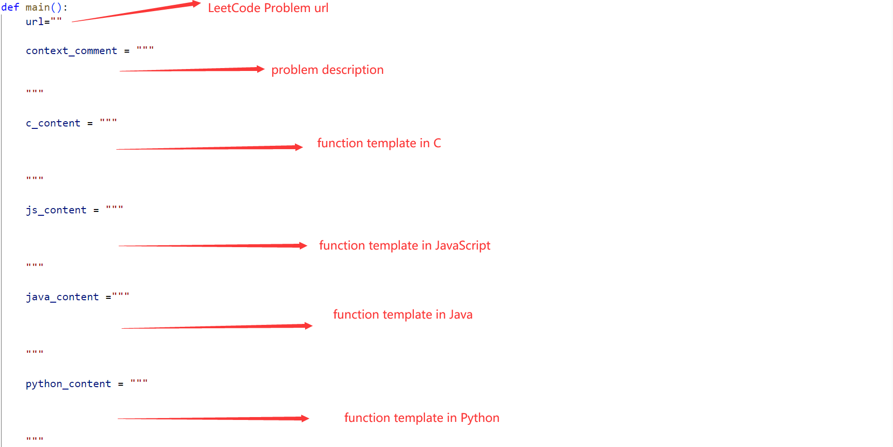

# Tool

## 1.PreUtil

This tool is based on the script by [Nguyen](https://github.com/nhtnhan/MSR2022_Copilot). We made a little modification so that the script automatically generates the file name from the url link of problem

```powershell
├── PreUtil
   ├──output                 :folder to store generated files              :guidance
   └──tool.py                :python script that generates code suggestion files in 4 languages
```

**How to use:**

open *tool.py* and respectively copy the content of problem url , problem description, function template of 4 languages and paste them in the following variables:



After filling the variable content, you can run this script and generate code suggestion files.

## 2. AfterUtil

This project helps us to calculate correctness and generate result-related files.

**Requirements**

- JDK:  *jdk 11*

- Dependencies: 
  - *fastjson-1.2.83*
  - *gson-2.9.0*
  - *jackson-annotations-2.12.1*
  - *jackson-core-2.12.1*
  - *jackson-databind-2.12.1*
  - *json-20211205*
  - *junit-4.13.1*


```powershell
├── AfterUtil
   ├──final_result              :folder to restore results of RQ1~RQ3
   ├──out                       :compiled class files
   ├──src                       :source code
   ├──test                      :unit test
   ├──type_info                 :folder contains text recording solved/unsolved problems on 12 problem types
   └──testcase_info.txt         :text file recording all test case information from submission result
```

**How to use**

We choose *testcase_info.txt* and *type_info* as input of our program. the content of *testcase_info.txt* can be copied from *SubmissionResult.xlsx*. the text files in *type_info* records the problem links and its solved/unsolved status(0 indicates unsolved).

You can get results of RQ1~RQ3 in *final_result* after running this program.